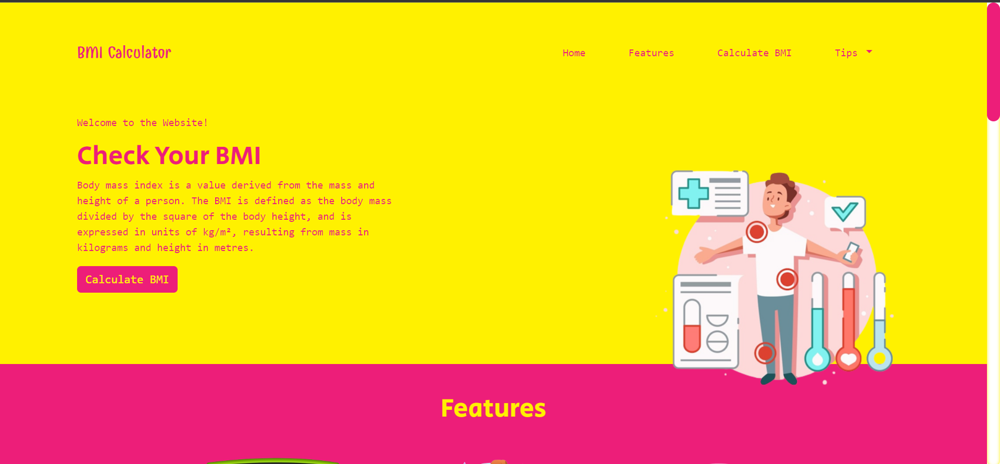

Project Name: BMI Calculator App
About: This is a BMI Calculator Website which helps in calculating the BMI of a person and then suggests some tips of the basis of his BMI Status.
Technologies Used: Vanilla JavaScript, HTML5, CSS3, Bootstrap5
Date of Creation: 07/09/2022
Special Features:
1. Calculates BMI
2. Provides BMI Status
3. Suggests Tips on the basis of your BMI

Click on the image to watch the Video :
;